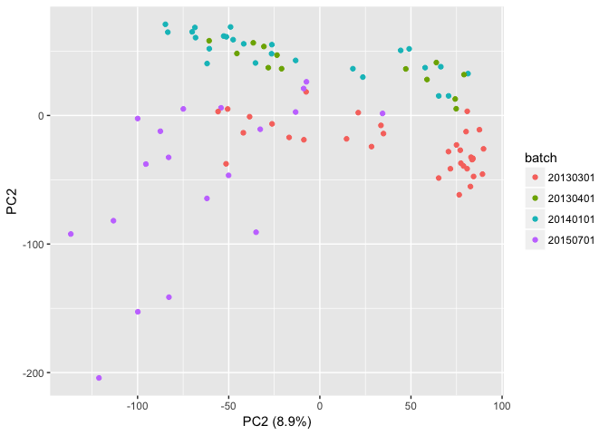
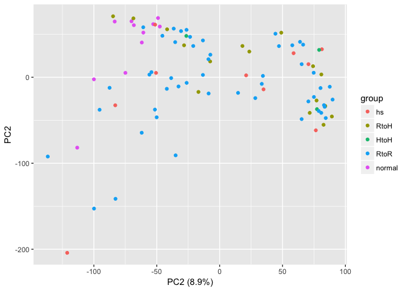
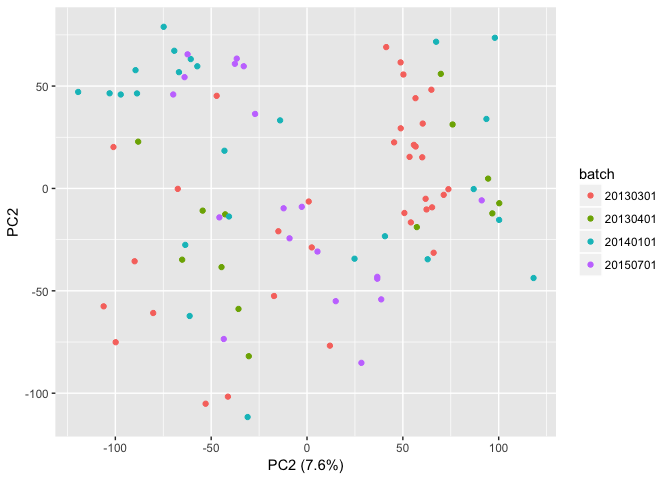
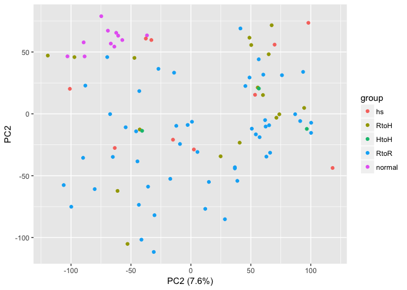
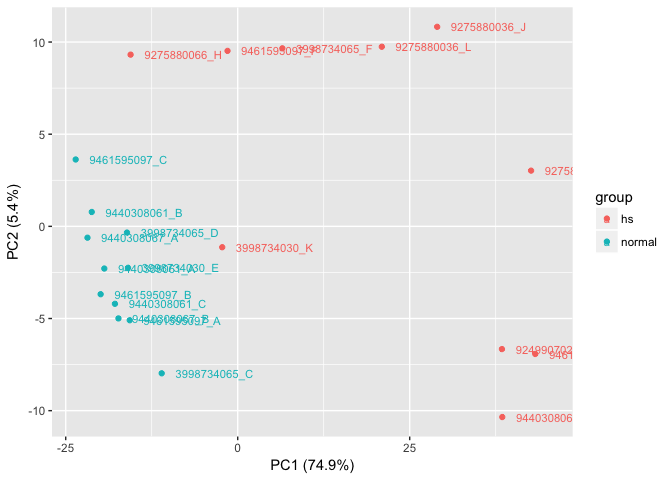
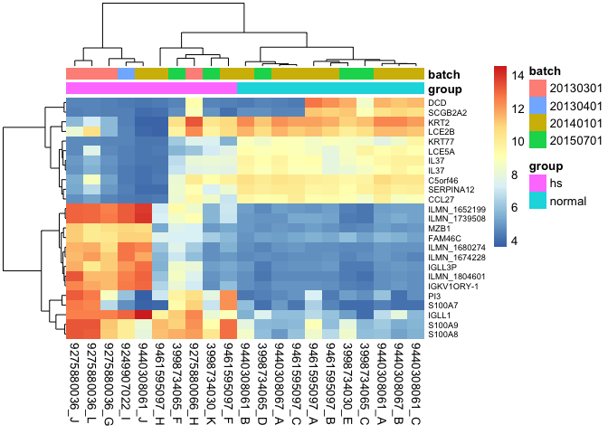

Hidradenitis Suppurativa mRNA expression profile analysis
================
Matthew L Bendall
5/2/2018

-   [Data Pre-Processing](#data-pre-processing)
    -   [Load data paths and sample data](#load-data-paths-and-sample-data)
    -   [Load bead level expression data](#load-bead-level-expression-data)
    -   [Filtering and Normalization](#filtering-and-normalization)
    -   [Batch effect correction](#batch-effect-correction)
    -   [ComBat adjustment](#combat-adjustment)
    -   [Principle components analysis, adjusted data](#principle-components-analysis-adjusted-data)
-   [Hidradenitis Suppurativa mRNA expression profile analysis](#hidradenitis-suppurativa-mrna-expression-profile-analysis)
    -   [Linear model](#linear-model)
    -   [Test for DE genes](#test-for-de-genes)
    -   [Principle Component Analysis](#principle-component-analysis)
    -   [Top DE Genes](#top-de-genes)
    -   [Create IPA output table](#create-ipa-output-table)

<style type="text/css">
h1,h2,h3,h4,h5,h6{color:#00008b}body{font-size:14px}table td{font-size:10px}.dataTables_wrapper,table th{font-size:12px}h1{font-size:40px}h2{font-size:32px}h3{font-size:24px}h4{font-size:20px}h5{font-size:16px}h6{font-size:12px}code.r,pre{font-size:10px}
</style>
Data Pre-Processing
-------------------

### Load data paths and sample data

The data directory is named `illumina_data` and is one level above the root of this repository (i.e. `../illumina_data`). Within the data directory is the manifest file `HumanHT-12_V4_0_R2_15002873_B.bgx` and subdirectories containing `*.idat` files. The files are named using Illumina convention: `<PLATE_NUM>/<PLATE_NUM>_<POSITION>_Grn.idat`. Here we load paths to the data:

``` r
if(!use_rdata) {
    bgxfile <- '../illumina_data/HumanHT-12_V4_0_R2_15002873_B.bgx'  
    idat_files <- Sys.glob('../illumina_data/*/*.idat')
    names(idat_files) <- gsub('_[a-zA-Z\\.]+$', '', basename(idat_files))
}
```

Load the patient data from the excel sheet. The file `array_locations.xlsx` contains the Illumina plate number and plate position, which is what we need to locate the matching data files.

``` r
if(!use_rdata) {
    # Levels for groups
    group_levels <- c('hs','RtoH', 'HtoH', 'RtoR', 'normal')
    
    # Plate ID to batch mapping
    batch_map <- c(
        "9275888003"='20130301',
        "9275880036"='20130301',
        "9275880066"='20130301',
        "9275880035"='20130301',
        "9275880064"='20130301',
        "9249907022"='20130401',
        "9249907050"='20130401',
        "9461595097"='20140101',
        "9440308061"='20140101',
        "9440308067"='20140101',
        "3998734065"='20150701',
        "3998734030"='20150701'
    )
    batch_levels <- c('20130301', '20130401', '20140101', '20150701')    
    
    samp <- read.xlsx('array_locations.xlsx', 1, 
                      colClasses='character', stringsAsFactors=F) %>%
        mutate(
            group = factor(group, levels=group_levels),
            batch = factor(batch_map[plate], levels=batch_levels)
        )
    row.names(samp) <- paste(samp$plate, samp$position, sep='_')

    all_plates <- row.names(samp)
}
```

    ## Warning: package 'bindrcpp' was built under R version 3.3.2

### Load bead level expression data

Load data from the `*.idat` files. We use the functions `beadarray::readIdatFiles` and `limma::read.idat` to read the files and load the data. The beadarray object is used to calculate detection probabilites (`beadarray::calculateDetection`) which are then added to a slot on the limma object.

``` r
if(!use_rdata) {

    # Create beadarray object
    raw_beadarray <- beadarray::readIdatFiles(idat_files[all_plates])

    # Create limma object
    raw_limma <- limma::read.idat(idat_files[all_plates], bgxfile)
    
    # Replace column and row names
    colnames(raw_limma) <- gsub('_Grn', '', basename(colnames(raw_limma)))
    rownames(raw_limma) <- raw_limma$genes[raw_limma$genes$Array_Address_Id==rownames(raw_limma), 'Probe_Id']
    
    # Check that objects have the same ordering for samples
    stopifnot(all(colnames(raw_limma) == colnames(raw_beadarray)))
    stopifnot(all(colnames(raw_limma) == all_plates))

    # Detection probabilities
    det <- beadarray::calculateDetection(raw_beadarray)
    
    # Add detection probs to objects
    Detection(raw_beadarray) <- det
    raw_limma$other$Detection <- det[rownames(raw_limma),]
    rm(det)
}
```

    ## Annotating control probes using package illuminaHumanv4.db Version:1.26.0

    ## Reading manifest file ../illumina_data/HumanHT-12_V4_0_R2_15002873_B.bgx ... Done
    ##   ../illumina_data/9440308067/9440308067_A_Grn.idat ... Done
    ##   ../illumina_data/9461595097/9461595097_C_Grn.idat ... Done
    ##   ../illumina_data/9461595097/9461595097_B_Grn.idat ... Done
    ##   ../illumina_data/9461595097/9461595097_A_Grn.idat ... Done
    ##   ../illumina_data/9440308067/9440308067_B_Grn.idat ... Done
    ##   ../illumina_data/9440308061/9440308061_C_Grn.idat ... Done
    ##   ../illumina_data/9440308061/9440308061_A_Grn.idat ... Done
    ##   ../illumina_data/9440308061/9440308061_B_Grn.idat ... Done
    ##   ../illumina_data/3998734065/3998734065_C_Grn.idat ... Done
    ##   ../illumina_data/3998734065/3998734065_D_Grn.idat ... Done
    ##   ../illumina_data/3998734030/3998734030_E_Grn.idat ... Done
    ##   ../illumina_data/3998734030/3998734030_K_Grn.idat ... Done
    ##   ../illumina_data/3998734065/3998734065_F_Grn.idat ... Done
    ##   ../illumina_data/9249907022/9249907022_I_Grn.idat ... Done
    ##   ../illumina_data/9275880036/9275880036_J_Grn.idat ... Done
    ##   ../illumina_data/9275880036/9275880036_G_Grn.idat ... Done
    ##   ../illumina_data/9275880036/9275880036_L_Grn.idat ... Done
    ##   ../illumina_data/9275880066/9275880066_H_Grn.idat ... Done
    ##   ../illumina_data/9440308061/9440308061_J_Grn.idat ... Done
    ##   ../illumina_data/9461595097/9461595097_F_Grn.idat ... Done
    ##   ../illumina_data/9461595097/9461595097_H_Grn.idat ... Done
    ##   ../illumina_data/9249907022/9249907022_F_Grn.idat ... Done
    ##   ../illumina_data/9249907050/9249907050_E_Grn.idat ... Done
    ##   ../illumina_data/9275880035/9275880035_A_Grn.idat ... Done
    ##   ../illumina_data/9275880036/9275880036_K_Grn.idat ... Done
    ##   ../illumina_data/9275880064/9275880064_A_Grn.idat ... Done
    ##   ../illumina_data/9275880066/9275880066_A_Grn.idat ... Done
    ##   ../illumina_data/9275880066/9275880066_I_Grn.idat ... Done
    ##   ../illumina_data/9275880066/9275880066_E_Grn.idat ... Done
    ##   ../illumina_data/9275880066/9275880066_L_Grn.idat ... Done
    ##   ../illumina_data/9275888003/9275888003_J_Grn.idat ... Done
    ##   ../illumina_data/9275888003/9275888003_B_Grn.idat ... Done
    ##   ../illumina_data/9440308061/9440308061_H_Grn.idat ... Done
    ##   ../illumina_data/9440308061/9440308061_E_Grn.idat ... Done
    ##   ../illumina_data/9440308061/9440308061_L_Grn.idat ... Done
    ##   ../illumina_data/9440308061/9440308061_K_Grn.idat ... Done
    ##   ../illumina_data/9440308067/9440308067_H_Grn.idat ... Done
    ##   ../illumina_data/9461595097/9461595097_G_Grn.idat ... Done
    ##   ../illumina_data/9249907050/9249907050_B_Grn.idat ... Done
    ##   ../illumina_data/9275888003/9275888003_G_Grn.idat ... Done
    ##   ../illumina_data/9440308067/9440308067_D_Grn.idat ... Done
    ##   ../illumina_data/3998734030/3998734030_D_Grn.idat ... Done
    ##   ../illumina_data/3998734030/3998734030_C_Grn.idat ... Done
    ##   ../illumina_data/3998734030/3998734030_F_Grn.idat ... Done
    ##   ../illumina_data/3998734030/3998734030_L_Grn.idat ... Done
    ##   ../illumina_data/3998734030/3998734030_A_Grn.idat ... Done
    ##   ../illumina_data/3998734030/3998734030_I_Grn.idat ... Done
    ##   ../illumina_data/3998734030/3998734030_H_Grn.idat ... Done
    ##   ../illumina_data/3998734065/3998734065_I_Grn.idat ... Done
    ##   ../illumina_data/3998734065/3998734065_B_Grn.idat ... Done
    ##   ../illumina_data/3998734065/3998734065_J_Grn.idat ... Done
    ##   ../illumina_data/3998734065/3998734065_A_Grn.idat ... Done
    ##   ../illumina_data/3998734065/3998734065_L_Grn.idat ... Done
    ##   ../illumina_data/3998734065/3998734065_E_Grn.idat ... Done
    ##   ../illumina_data/3998734065/3998734065_K_Grn.idat ... Done
    ##   ../illumina_data/9249907022/9249907022_G_Grn.idat ... Done
    ##   ../illumina_data/9249907022/9249907022_D_Grn.idat ... Done
    ##   ../illumina_data/9249907022/9249907022_J_Grn.idat ... Done
    ##   ../illumina_data/9249907022/9249907022_A_Grn.idat ... Done
    ##   ../illumina_data/9249907050/9249907050_K_Grn.idat ... Done
    ##   ../illumina_data/9249907050/9249907050_G_Grn.idat ... Done
    ##   ../illumina_data/9249907050/9249907050_D_Grn.idat ... Done
    ##   ../illumina_data/9249907050/9249907050_A_Grn.idat ... Done
    ##   ../illumina_data/9249907050/9249907050_C_Grn.idat ... Done
    ##   ../illumina_data/9275880035/9275880035_D_Grn.idat ... Done
    ##   ../illumina_data/9275880035/9275880035_B_Grn.idat ... Done
    ##   ../illumina_data/9275880035/9275880035_C_Grn.idat ... Done
    ##   ../illumina_data/9275880036/9275880036_H_Grn.idat ... Done
    ##   ../illumina_data/9275880036/9275880036_E_Grn.idat ... Done
    ##   ../illumina_data/9275880036/9275880036_I_Grn.idat ... Done
    ##   ../illumina_data/9275880036/9275880036_F_Grn.idat ... Done
    ##   ../illumina_data/9275880064/9275880064_C_Grn.idat ... Done
    ##   ../illumina_data/9275880064/9275880064_B_Grn.idat ... Done
    ##   ../illumina_data/9275880066/9275880066_F_Grn.idat ... Done
    ##   ../illumina_data/9275880066/9275880066_G_Grn.idat ... Done
    ##   ../illumina_data/9275880066/9275880066_K_Grn.idat ... Done
    ##   ../illumina_data/9275880066/9275880066_D_Grn.idat ... Done
    ##   ../illumina_data/9275880066/9275880066_B_Grn.idat ... Done
    ##   ../illumina_data/9275880066/9275880066_J_Grn.idat ... Done
    ##   ../illumina_data/9275888003/9275888003_F_Grn.idat ... Done
    ##   ../illumina_data/9275888003/9275888003_C_Grn.idat ... Done
    ##   ../illumina_data/9275888003/9275888003_E_Grn.idat ... Done
    ##   ../illumina_data/9275888003/9275888003_D_Grn.idat ... Done
    ##   ../illumina_data/9275888003/9275888003_A_Grn.idat ... Done
    ##   ../illumina_data/9440308067/9440308067_G_Grn.idat ... Done
    ##   ../illumina_data/9440308067/9440308067_E_Grn.idat ... Done
    ##   ../illumina_data/9440308067/9440308067_K_Grn.idat ... Done
    ##   ../illumina_data/9440308067/9440308067_F_Grn.idat ... Done
    ##   ../illumina_data/9461595097/9461595097_E_Grn.idat ... Done
    ##   ../illumina_data/9461595097/9461595097_L_Grn.idat ... Done
    ##   ../illumina_data/9461595097/9461595097_K_Grn.idat ... Done
    ## Finished reading data.
    ## 
      |                                                                       
      |                                                                 |   0%
      |                                                                       
      |=                                                                |   1%
      |                                                                       
      |=                                                                |   2%
      |                                                                       
      |==                                                               |   3%
      |                                                                       
      |===                                                              |   4%
      |                                                                       
      |====                                                             |   6%
      |                                                                       
      |====                                                             |   7%
      |                                                                       
      |=====                                                            |   8%
      |                                                                       
      |======                                                           |   9%
      |                                                                       
      |======                                                           |  10%
      |                                                                       
      |=======                                                          |  11%
      |                                                                       
      |========                                                         |  12%
      |                                                                       
      |=========                                                        |  13%
      |                                                                       
      |=========                                                        |  14%
      |                                                                       
      |==========                                                       |  16%
      |                                                                       
      |===========                                                      |  17%
      |                                                                       
      |============                                                     |  18%
      |                                                                       
      |============                                                     |  19%
      |                                                                       
      |=============                                                    |  20%
      |                                                                       
      |==============                                                   |  21%
      |                                                                       
      |==============                                                   |  22%
      |                                                                       
      |===============                                                  |  23%
      |                                                                       
      |================                                                 |  24%
      |                                                                       
      |=================                                                |  26%
      |                                                                       
      |=================                                                |  27%
      |                                                                       
      |==================                                               |  28%
      |                                                                       
      |===================                                              |  29%
      |                                                                       
      |====================                                             |  30%
      |                                                                       
      |====================                                             |  31%
      |                                                                       
      |=====================                                            |  32%
      |                                                                       
      |======================                                           |  33%
      |                                                                       
      |======================                                           |  34%
      |                                                                       
      |=======================                                          |  36%
      |                                                                       
      |========================                                         |  37%
      |                                                                       
      |=========================                                        |  38%
      |                                                                       
      |=========================                                        |  39%
      |                                                                       
      |==========================                                       |  40%
      |                                                                       
      |===========================                                      |  41%
      |                                                                       
      |===========================                                      |  42%
      |                                                                       
      |============================                                     |  43%
      |                                                                       
      |=============================                                    |  44%
      |                                                                       
      |==============================                                   |  46%
      |                                                                       
      |==============================                                   |  47%
      |                                                                       
      |===============================                                  |  48%
      |                                                                       
      |================================                                 |  49%
      |                                                                       
      |================================                                 |  50%
      |                                                                       
      |=================================                                |  51%
      |                                                                       
      |==================================                               |  52%
      |                                                                       
      |===================================                              |  53%
      |                                                                       
      |===================================                              |  54%
      |                                                                       
      |====================================                             |  56%
      |                                                                       
      |=====================================                            |  57%
      |                                                                       
      |======================================                           |  58%
      |                                                                       
      |======================================                           |  59%
      |                                                                       
      |=======================================                          |  60%
      |                                                                       
      |========================================                         |  61%
      |                                                                       
      |========================================                         |  62%
      |                                                                       
      |=========================================                        |  63%
      |                                                                       
      |==========================================                       |  64%
      |                                                                       
      |===========================================                      |  66%
      |                                                                       
      |===========================================                      |  67%
      |                                                                       
      |============================================                     |  68%
      |                                                                       
      |=============================================                    |  69%
      |                                                                       
      |==============================================                   |  70%
      |                                                                       
      |==============================================                   |  71%
      |                                                                       
      |===============================================                  |  72%
      |                                                                       
      |================================================                 |  73%
      |                                                                       
      |================================================                 |  74%
      |                                                                       
      |=================================================                |  76%
      |                                                                       
      |==================================================               |  77%
      |                                                                       
      |===================================================              |  78%
      |                                                                       
      |===================================================              |  79%
      |                                                                       
      |====================================================             |  80%
      |                                                                       
      |=====================================================            |  81%
      |                                                                       
      |=====================================================            |  82%
      |                                                                       
      |======================================================           |  83%
      |                                                                       
      |=======================================================          |  84%
      |                                                                       
      |========================================================         |  86%
      |                                                                       
      |========================================================         |  87%
      |                                                                       
      |=========================================================        |  88%
      |                                                                       
      |==========================================================       |  89%
      |                                                                       
      |==========================================================       |  90%
      |                                                                       
      |===========================================================      |  91%
      |                                                                       
      |============================================================     |  92%
      |                                                                       
      |=============================================================    |  93%
      |                                                                       
      |=============================================================    |  94%
      |                                                                       
      |==============================================================   |  96%
      |                                                                       
      |===============================================================  |  97%
      |                                                                       
      |================================================================ |  98%
      |                                                                       
      |================================================================ |  99%
      |                                                                       
      |=================================================================| 100%

### Filtering and Normalization

We perform normexp background correction using negative control probes and quantile normalization using negative and positive control probes. This is implemented in the `neqc` function of the `limma` package, and is a recommended approach for Illumina BeadChips.

``` r
if(!use_rdata) {
    # Normalization
    norm_limma <- neqc(raw_limma)
}
```

We filter probes by two criteria. First is the Illumina probe quality:

> Quality grade assigned to the probe: “Perfect” if it perfectly and uniquely matches the target transcript; “Good” if the probe, although imperfectly matching the target transcript, is still likely to provide considerably sensitive signal (up to two mismatches are allowed, based on empirical evidence that the signal intensity for 50-mer probes with less than 95% identity to the respective targets is less than 50% of the signal associated with perfect matches \*); “Bad” if the probe matches repeat sequences, intergenic or intronic regions, or is unlikely to provide specific signal for any transcript; “No match” if it does not match any genomic region or transcript.

The other filter criteria is the detection probability, which we calculated using the `calculateDetection` function in the `beadarray` package. (We calculated this above from the raw expression values). If a probe fails to meet the detection threshold (&lt; 0.05) in at least three samples, we consider the probe as "not expressed and remove it from analysis.

``` r
if(!use_rdata) {
    # Filtering
    # Quality for each probe
    qual <- unlist(mget(as.character(rownames(norm_limma)),
                        illuminaHumanv4PROBEQUALITY,
                        ifnotfound = NA))

    # At least 3 samples are "detected"
    expressed <- rowSums(norm_limma$other$Detection < 0.05, na.rm=TRUE) >= 3
    qual[!expressed] <- 'NoExp'
    table(qual)

    rem <- qual == "No match" | qual == "Bad" | qual == 'NoExp' | is.na(qual)
    filt_limma <- norm_limma[!rem,]
    rm(qual,rem)
}
```

Create an ExpressionSet object for use with R.

``` r
if(!use_rdata) {
    pdata.df <- data.frame(ID=row.names(samp), samp)

    # Create expression set
    exset.norm <- ExpressionSet(
        assayData = filt_limma$E,
        phenoData = AnnotatedDataFrame(
            droplevels(data.frame(pdata.df, row.names='ID'))
        )
    )
}
```

### Batch effect correction

#### Principle components analysis, normalized data

We use principle components analysis to identify batch effects. Each sample is plotted according to its distance from the other samples. If samples from the same batch cluster more closely than samples from the same condition, it suggests that batch effects are the source of some of the variance in the data.

``` r
pc.n <- prcomp(t(exprs(exset.norm)), retx=T, center=T, scale=T)
# Proportion of variance explained by each component
pc.n.pov <- (pc.n$sdev^2) / sum(pc.n$sdev^2)
```

##### PCA plot of normalized data, colored by batch

``` r
cbind(pData(exset.norm), pc.n$x) %>%
    ggplot(aes(PC1, PC2)) +
    geom_point(aes(color=batch)) +
    xlab(sprintf('PC1 (%.1f%%)', pc.n.pov[1]*100)) +
    xlab(sprintf('PC2 (%.1f%%)', pc.n.pov[2]*100))
```



##### PCA plot of normalized data, colored by group

``` r
cbind(pData(exset.norm), pc.n$x) %>%
    ggplot(aes(PC1, PC2)) +
    geom_point(aes(color=group)) +
    xlab(sprintf('PC1 (%.1f%%)', pc.n.pov[1]*100)) +
    xlab(sprintf('PC2 (%.1f%%)', pc.n.pov[2]*100))
```



From examining these two plots, it appears that samples are clustering by the `batch` variable. In particular, the `20150701` and `20130301` batches (in purple and orange) appear distinct. Based on this we will use the ComBat method for batch correction.

### ComBat adjustment

ComBat allows users to adjust for batch effects in datasets where the batch covariate is known, using methodology described in Johnson et al. 2007. It uses either parametric or non-parametric empirical Bayes frameworks for adjusting data for batch effects. Users are returned an expression matrix that has been corrected for batch effects. The input data are assumed to be cleaned and normalized before batch effect removal.

``` r
if(!use_rdata) {
    mod <- model.matrix(~ group, data=pData(exset.norm))
    tmp.exprs <- ComBat(dat=exprs(exset.norm), batch=pData(exset.norm)$batch, mod=mod,
                        par.prior=TRUE, prior.plots=FALSE)

    # Create expression set
    exset.combat <- ExpressionSet(
        assayData = tmp.exprs,
        phenoData = phenoData(exset.norm)
    )
}
```

    ## Found 4 batches
    ## Adjusting for 4 covariate(s) or covariate level(s)
    ## Standardizing Data across genes
    ## Fitting L/S model and finding priors
    ## Finding parametric adjustments
    ## Adjusting the Data

### Principle components analysis, adjusted data

``` r
pc.c <- prcomp(t(exprs(exset.combat)), retx=T, center=T, scale=T)
# Proportion of variance explained by each component
pc.c.pov <- (pc.c$sdev^2) / sum(pc.c$sdev^2)
```

##### PCA plot of adjusted data, colored by batch

``` r
cbind(pData(exset.combat), pc.c$x) %>%
    ggplot(aes(PC1, PC2)) +
    geom_point(aes(color=batch)) +
    xlab(sprintf('PC1 (%.1f%%)', pc.c.pov[1]*100)) +
    xlab(sprintf('PC2 (%.1f%%)', pc.c.pov[2]*100))
```



##### PCA plot of adjusted data, colored by group

``` r
cbind(pData(exset.combat), pc.c$x) %>%
    ggplot(aes(PC1, PC2)) +
    geom_point(aes(color=group)) +
    xlab(sprintf('PC1 (%.1f%%)', pc.c.pov[1]*100)) +
    xlab(sprintf('PC2 (%.1f%%)', pc.c.pov[2]*100))
```



The batches do not appear to be distinct. We will move forward with the corrected expression data.

Hidradenitis Suppurativa mRNA expression profile analysis
---------------------------------------------------------

Set default values and load data.

``` r
# False Discovery Rate
fdr_level <- 0.05

# Log Fold Change cutoff
lfc_cutoff <- 1

# Mapping of probe names to symbols
probe2sym <- as.list(illuminaHumanv4SYMBOL[mappedkeys(illuminaHumanv4SYMBOL)])

load('final_combat.Rdata')
# Use the ComBat adjusted values
exset <- exset.combat

glevels <- c('hs', 'normal')
sel <- pData(exset)$group %in% glevels
cur <- exset[,sel]

# Relevel "group" variable
phenoData(cur)$group <- factor(phenoData(cur)$group, levels=glevels)
```

### Linear model

We have 2 groups of patients:

-   *hs* - Patients with Hidradenitis suppurativa
-   *normal* - Normal controls from skin graft

The linear model we use contains one independent variable, `group` with two levels: `hs` and `normal`. The contrast we are interested in is `hs - normal`.

``` r
design <- model.matrix(~0 + group, data=pData(cur))
colnames(design) <- gsub('group', '', colnames(design))
cont.matrix <- makeContrasts(hs..normal = hs - normal,
                             levels=design)

fit <- lmFit(cur, design)
fit2 <- contrasts.fit(fit, cont.matrix)
fit2 <- eBayes(fit2, trend=TRUE, robust=TRUE)
```

### Test for DE genes

Next we test for differentially expressed genes. DE genes have a false discovery rate FDR &lt; 0.050 and have absolute log2-fold change greater than or equal to abs(logFC) &gt;= 1.000. (This log2-fold cutoff is equivalent to 2.0x changes).

``` r
results <- decideTests(fit2, method="separate", adjust.method="BH",
                       p.value=fdr_level, lfc=lfc_cutoff)
summary(results)
```

    ##    hs..normal
    ## -1        363
    ## 0       28764
    ## 1         436

Found 363 genes that are underexpressed in HS patients and 436 genes that are overexpressed in HS patients.

### Principle Component Analysis

**NOTE**: This analysis only uses genes that meet our criteria.

``` r
pc.1 <- prcomp(t(exprs(cur)[results@.Data != 0, ]), retx=T, center=T, scale=T)
pc.1.pov <- (pc.1$sdev^2) / sum(pc.1$sdev^2)

cbind(pData(cur), pc.1$x) %>%
    ggplot(aes(PC1, PC2)) +
    geom_point(aes(color=group)) +
    geom_text(aes(label=paste(plate, position, sep='_'), color=group), hjust=0, nudge_x=2, size=3) +
    xlab(sprintf('PC1 (%.1f%%)', pc.1.pov[1]*100)) +
    ylab(sprintf('PC2 (%.1f%%)', pc.1.pov[2]*100))
```



### Top DE Genes

Heatmap showing 25 signficantly DE genes with the greatest absolute fold change between `hs` and `normal` samples.

``` r
tt <- topTable(fit2, adjust='BH', n=25, p.value=fdr_level, sort.by='logFC')

hm.rownames <- sapply(row.names(tt), function(p) {
    if(p %in% names(probe2sym)) unlist(probe2sym[p]) else p
})
names(hm.rownames) <- row.names(tt)

pdf('figure1.pdf', paper='letter', onefile=FALSE)
pheatmap(as.matrix(exprs(cur)[row.names(tt),]),
         border_color = NA,
         clustering_distance_rows='euclidean',
         clustering_distance_cols='euclidean',
         clustering_method = 'ward.D2',
         annotation_col=pData(cur)[,c('group','batch')],
         labels_row=hm.rownames, fontsize_row=7
)
dev.off()
```

    ## quartz_off_screen 
    ##                 2

``` r
pheatmap(as.matrix(exprs(cur)[row.names(tt),]),
         border_color = NA,
         clustering_distance_rows='euclidean',
         clustering_distance_cols='euclidean',
         clustering_method = 'ward.D2',
         annotation_col=pData(cur)[,c('group','batch')],
         labels_row=hm.rownames, fontsize_row=7
)
```



### Create IPA output table

Output **all** significantly DE genes to an excel file for use in IPA. We do **not** use a cutoff for LFC here since this can be done in downstream analysis.

``` r
topTable(fit2, coef='hs..normal', adjust='BH', n=Inf, p.value=fdr_level) %>%
    tibble::rownames_to_column(var='Probe') %>%
    dplyr::select(Probe, adj.P.Val, logFC, AveExpr) %>%
    dplyr::arrange(logFC) %>% data.frame %>%
    write.xlsx(file='hs_normal.ipa.xlsx', col.names=T, row.names=F)
```
